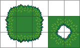
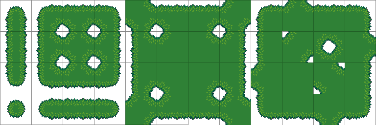

# Minimal tileset terrain 

Tool for creating a full 3x3 peer bit terrain (which has 48 tiles) from just 13 tiles. 


Input image <i>( 3x3 + 2x2 = 13 tile parts, here 32 px tile size )</i>



Output image  <i>( 12 x 4 = 48 terrain tiles 3x3 peering, here 64 px tile size ) </i>



## How to use 

Simply create an input image and call the Python function `terrain_from_parts` located in `placement.py`
    
```
    terrain_from_parts(input_file_path [, output_file_path] )
```


## Caveat !

The resulting output tile set will have **twice** the tile size as the input tile set!